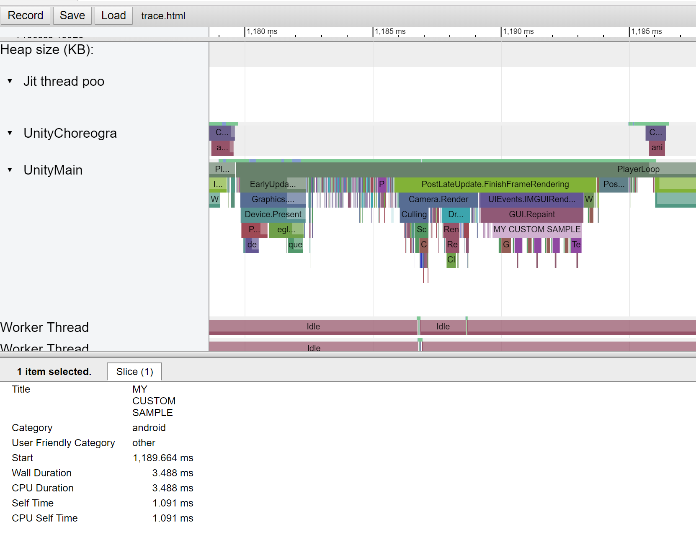

# Unity Systrace Plugin for Android

Unity profiler has a nice timeline view with named sections. It may be very helpful to have these sections displayed on a system-wide trace collected from an Android device using systrace tool, as it gives information about scheduling, CPU status, other processes running in the system etc.
In version 2018.2, Unity introduced a profiler native plugin API; used together with Android tracing API, it allows to develop an integration plugin.

Few comments on the implementation:
-	Android tracing API works on Marshmallow and later; but since Unity supports older devices, I used dynamic linking. On older devices, a warning is printed, and the Unity profiler integration is disabled.
-	To load a native plugin in Android, Unity requires a P/Invoke call to an imported native method. Because of this a script was added; make sure to attach it to a game object in your scene!
-	Due to optimization (the plugin checks if systrace is connected every frame, and if it is - registers callbacks for profiler markers; if no systrace is connected - no callbacks are happening for every profiler marker) Unity markers can show up from the next frame after starting the systrace capture.

## System Requirements
-	Unity 2018.2 or later
-	Android device with Android 6.0 Marshmallow or later

## Usage
1.	Copy the contents of `Assets` directory to your project (it will be easier if you retain the path, then the plugin importer will set CPU architecture for the .so's correctly)
2.	Attach the `Assets/Scripts/SystracePlugin.cs` script to a game object of your choice in your first scene to make sure the plugin is loaded as early as possible
3.	Enjoy

## How to Build
Run `ndk-build` in `src/` directory of the repo. Grab the libraries in `src/libs/`

## Useful Links
-	https://developer.android.com/studio/command-line/systrace
-	https://developer.android.com/ndk/reference/group/tracing
